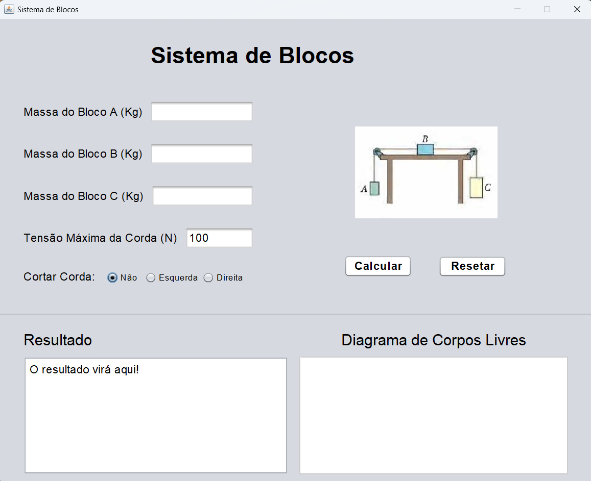

[Git] https://img.shields.io/badge/git-%23F05033.svg?style=for-the-badge&logo=git&logoColor=white
[Java] https://img.shields.io/badge/java-%23ED8B00.svg?style=for-the-badge&logo=openjdk&logoColor=white
[MIT__BADGE]: https://img.shields.io/github/license/Naereen/StrapDown.js.svg

<h1 align="center" style="font-weight: bold;">📦 Sistema de Blocos</h1>

![java][Java]
![git][Git]
![mit][MIT__BADGE]

  <a href="#sobre">Sobre</a> • 
  <a href="#acesso">Instalação</a> • 
  <a href="#funcionalidades">Funcionalidades</a> •
  <a href="#licenca">Licença</a> •

 

    

 

<h2 id="sobre">📌 Sobre</h2>
Um <ins>projeto da faculdade</ins> da matéria de física, no qual foi realizado um programa em <strong>Java</strong> que calcula um exercício de física. O exercício escolhido é um sistema com 3 blocos, no qual os blocos estão ligados por uma corda e calcula a aceleração, a tração e mostra um diagrama de corpos livres.

 
 

<h2 id="acesso">🚀 Acesse o Projeto</h2>

 
 

<h2 id="funcionalidades">💻 Funcionalidades</h2>

Nesta sessão esta as funcionalidades do projeto.

  
<h3>Sumário</h3>

  <ol>
  <li><a href="#">Interface Gráfica</a></li>
    <li><a href="#">Restrições de Entrada</a></li>
    <li><a href="#">Cálculo do Exercício</a></li>
    <li><a href="#">Exibição de Resposta</a></li>
    <li><a href="#">Diagrama de Corpos Livres</a></li>
    <li><a href="#">Reset de Dados</a></li>
  </ol>

 
 

<h2 id="licenca">📃 Licença</h2>
Veja a lincença do projeto: <a href="https://github.com/JoaoVitorDomingos/Sistema-de-Blocos?tab=MIT-1-ov-file">MIT License</a>
 
 
