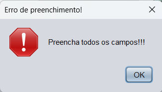
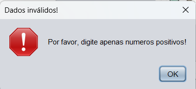
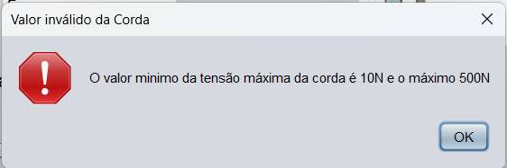
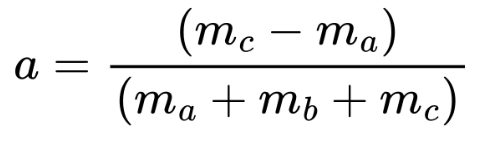
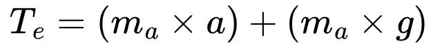
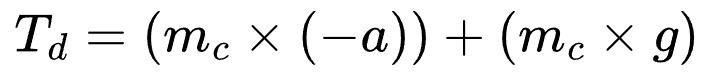
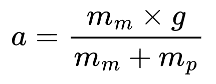
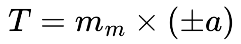
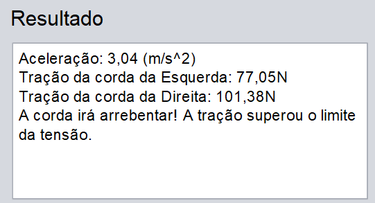
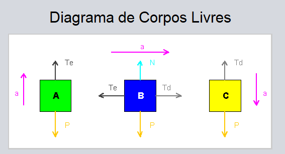

<h1 align="center" style="font-weight: bold;">📦 Sistema de Blocos</h1>

  <a href="#sobre">Sobre</a> • 
  <a href="#acesso">Instalação</a> • 
  <a href="#exercicio">Exercício</a> •
  <a href="#funcionalidades">Funcionalidades</a> •
  <a href="#licenca">Licença</a> •

 

    

 

<h2 id="sobre">📌 Sobre</h2>

Um <ins>projeto da faculdade</ins> da matéria de física, no qual foi realizado um programa em <strong>Java</strong> que calcula um exercício de física. O exercício escolhido é um sistema com 3 blocos, no qual os blocos estão ligados por uma corda e roldanas, e calcula a aceleração, a tração e mostra um diagrama de corpos livres.

 
 

<h2 id="acesso">🚀 Instalação</h2>
<h3>Requisitos</h3>

É necessário ter o <ins>JDK 24</ins> instalado em sua máquina para poder rodar o projeto, <a href="https://download.oracle.com/java/24/latest/jdk-24_windows-x64_bin.exe">baixe aqui</a>

<h3>Execute o Programa</h3>

Baixe o executável do programa <CODE>(.jar)</CODE> <a href="https://github.com/JoaoVitorDomingos/Sistema-de-Blocos/releases/tag/1.0.0">aqui</a>. E com dois cliques, execute-o.

 
 

<h2 id="exercicio">Exercício</h2>

Este é um famoso exercício de física para mostrar as leis de Newton, principalmente a segunda, no qual temos 3 blocos ligados por uma corda e roldanas, o bloco do meio está em cima de uma mesa e os outros dois pendurados, um na esquerda e outroa na direita.

Neste exercício, a massa da corda e das roldanas são desprezadas, e pede para calcular a tração da esquerda, porém é necessário, para este fim, calcular a aceleração, portanto, o programa é capaz de calcular a aceleração, a tração da esquerda e direita e analisa se a corda arrebenta, adicionando um valor máximo de tensão à corda.

O primeiro passo para resolver o problema é construir um diagrama de corpos livres, analisando as forças que atuam sobre os blocos, então, o programa também desenha um diagrama de corpos livres, mostrando a direção da aceleração, das trações e outras forças (adotado como positivo da esquerda para direita no eixo x e para cima no eixo y)

É possível também cortar uma das cordas, assim se tornando um sistema com 2 blocos, e o que teve sua corda cortada vira um exercício de queda livre, que não foi abordado, mas foi realizado seu desenho de forças.

 
 

<h2 id="funcionalidades">💻 Funcionalidades</h2>

Nesta sessão está as funcionalidades do projeto.

  
<h3>Sumário</h3>

  <ol>
  <li><a href="#interface">Interface Gráfica</a></li>
    <li><a href="#restricoes">Restrições de Entrada</a></li>
    <li><a href="#calculo">Cálculo do Exercício</a></li>
    <li><a href="#respostas">Exibição de Resposta</a></li>
    <li><a href="#diagrama">Diagrama de Corpos Livres</a></li>
    <li><a href="#reset">Reset de Dados</a></li>
  </ol>

<h3 id="interface">Interface Gráfica</h3>

Há uma interface gráfica feita em Swing, no qual foi utilizado a ferramenta do NeatBeans.

Possui labels, inputs, radio buttons, botões, uma imagem, um TexteArea para mostrar as respostas e um JPanel para realizar o desenho do diagrama de corpos livres.

Não é possível diminuir nem aumentar o tamanho da janela para impedir que o layout se quebre, ou seja, também não é possível maximizar a janela.

 
 

<h3 id="restricoes">Restrições de Entrada</h3>

Há restriçoes para a entrada do usuário para que condiza com a realidade os cálculos.

Não é possível adicionar valores negativos ou não-numéricos para a massa e a tensão máxima da corda, até porque isso não existe. E tem um limite máximo de 200Kg para as massas e 500N para a tensão máxima da corda, a corda tem uma restrição mínima, onde diz que sua tensão deve ser no mínimo 10N

Também há uma verificação que analisa se todos os inputs estão preechidos. Caso uma das restrições sejam feridas, mostra um JOptionalPane que alerta sobre a restrição.

  
  
  
  

 
 

<h3 id="calculo">Cálculo do Exercício</h3>

A partir da resolução do exercício, se acha uma formula geral para realizar as calculos para qualquer entrada de massa. A formula se altera quando uma das cordas é cortada.

<strong>Calculo para o sistema com 3 Blocos:</strong>

    
    
    

<strong>Legenda:</strong>

<ul>
  <li>a: Aceleração
  <li>Ma: Massa do Bloco A.
  <li>Mb: Massa do Bloco B.
  <li>Mc: Massa do Bloco C.
  <li>g: Aceleração da Gravidade.
  <li>Te: Tração da Esquerda.
  <li>Td: Tração da Direita.
</ul>

 

<strong>Calculo para o sistema com 2 Blocos:</strong>

Obs: Dependendo de qual corda é cortada, o valor da aceleração e da tração podem assumir valores negativos, pois estaram contra o eixo positivo.

    
    

<strong>Legenda:</strong>

<ul>
  <li>a: Aceleração
  <li>Mm: Massa do Bloco que esta em cima da Mesa.
  <li>Mp: Massa do Bloco Pendurado.
  <li>T: Tração.
  <li>g: Aceleração da Gravidade.
</ul>

 
 

<h3 id="respostas">Exibição de Resposta</h3>

Ao realizar os cálculos, é exibido as resposta no <CODE>JText Area</CODE>, é mostrado o valor da aceleração, da tração da esquerda, da direita e se a corda arrebenta.

 
 

<h3 id="diagrama">Diagrama de Corpos Livres</h3>

Foi utilizado a biblioteca <CODE>Graphics</CODE> e <CODE>Graphics2D</CODE> para realizar os desenhos do diagrama de corpos livres.

Há uma classe apenas para esta finalidade, que herda <CODE>JPanel</CODE>, e possui metodos para realizar o desenho.

 
 

<h3 id="reset">Reset de Dados</h3>

Há um botão para limpar todos os valores de entradas do usuário.

Os inputs de massas são limpados, o input da tensão máxima da corda recebe o valor 100, o radio button volta para o padrão, que é não

A área de resposta é limpa e o diagrama de corpos livres também.

 
 

<h2 id="licenca">📃 Licença</h2>
Veja a lincença do projeto: <a href="https://github.com/JoaoVitorDomingos/Sistema-de-Blocos?tab=MIT-1-ov-file">MIT License</a>
 
 
